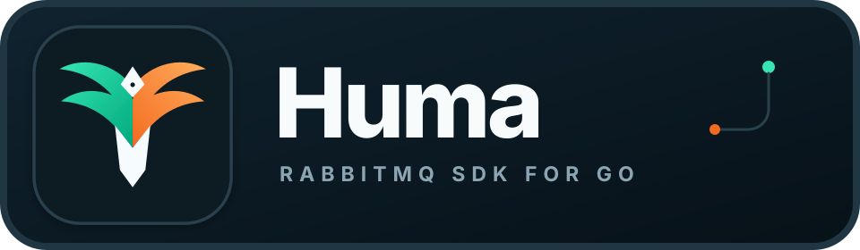

<p align="center">
  
</p>

<p align="center">
  A Go SDK for RabbitMQ consumers and publishers, built on
  <a href="https://github.com/rabbitmq/amqp091-go"><code>rabbitmq/amqp091-go</code></a>.
</p>

<p align="center">
  <a href="https://github.com/snapp-incubator/huma/actions/workflows/ci.yml"></a>
  <a href="https://pkg.go.dev/github.com/snapp-incubator/huma"></a>
  <a href="LICENSE"></a>
</p>

Huma provides concurrent consumers, connection recovery, publisher channel pooling and
confirms, bounded retries, dead-letter and delayed-delivery helpers, Prometheus metrics, and
OpenTelemetry context propagation.

The latest release is `v0.1.0`. Until `v1.0.0`, minor releases may include breaking API changes.

## Requirements

- Go 1.25 or later.
- RabbitMQ 4.x for the included examples.

## Install

```sh
go get github.com/snapp-incubator/huma
```

## Quick Start

```go
ctx, stop := signal.NotifyContext(context.Background(), os.Interrupt)
defer stop()

sdk, err := huma.NewSDK(ctx, huma.SDKConfig{
    Addr:           "127.0.0.1:5672",
    Username:       "guest",
    Password:       "guest",
    ConnectionName: "my-service",
})
if err != nil {
    log.Fatal(err)
}

queues := []huma.QueueConfig{{
    Name:           "my.queue",
    Durable:        true,
    NumWorkers:     4,
    ProcessTimeout: 30 * time.Second,
    Handler: func(ctx context.Context, queueName huma.QueueName, msg huma.RabbitMQMsg) error {
        log.Printf("received from %s: %s", queueName, msg.Body)
        return nil
    },
}}

if err := sdk.DeclareQueues(ctx, queues...); err != nil {
    log.Fatal(err)
}
if err := sdk.Start(ctx, queues); err != nil {
    log.Fatal(err)
}

if err := sdk.Publish(ctx, "", "my.queue", huma.NewMessage().WithBody([]byte("hello"))); err != nil {
    log.Printf("publish failed: %v", err)
}

<-ctx.Done()
shutdownCtx, cancel := context.WithTimeout(context.Background(), 10*time.Second)
defer cancel()
if err := sdk.Shutdown(shutdownCtx); err != nil {
    log.Printf("shutdown failed: %v", err)
}
```

See [`examples/basic`](examples/basic/main.go) for a complete runnable program, including
imports and structured logging.

## Configuration

| Field | Default | Description |
|---|---|---|
| `Addr` | required | RabbitMQ address in `host:port` form. |
| `Username`, `Password` | empty | AMQP credentials. Reserved URL characters are escaped. |
| `VHost` | `""` | RabbitMQ virtual host. |
| `Heartbeat` | client default | AMQP heartbeat interval. |
| `DialTimeout` | `30s` | TCP connection timeout. |
| `TLSConfig` | `nil` | Enables AMQPS with the supplied `*tls.Config`. |
| `ConnectionName` | `""` | Name shown in the RabbitMQ management UI. |
| `ReconnectDelay` | `5s` | Delay between reconnect attempts. |
| `PublisherPoolSize` | `5` | Initial number of publisher channels. |
| `PublisherMaxPoolSize` | twice the initial size | Maximum publisher channels. |
| `PublisherPoolWait` | `20ms` | Maximum wait for a channel after the pool reaches its limit. |
| `EnableMetrics` | `false` | Enables Prometheus collectors. |
| `MetricsNamespace` | `"huma"` | Prometheus metric namespace. |
| `MetricsRegisterer` | default registerer | Optional custom `prometheus.Registerer`. |
| `EnableTracing` | `false` | Injects and extracts OpenTelemetry context through AMQP headers. |
| `MetricLabelName`, `MetricLabelValue` | disabled | Adds one application-defined label to queue metrics. |
| `InjectHeaders`, `ExtractContext` | disabled | Application-defined publish and consume context hooks. |

`NewSDK` returns an error instead of panicking if metric registration fails, including when
another SDK has already registered the same namespace in the same registry.

## Delivery Guarantees

Every publish uses a RabbitMQ publisher-confirm channel and returns only after the broker
acknowledges or rejects the publish. Publishing to the default exchange with a queue name as
the routing key is the simplest way to avoid unroutable messages. Huma does not currently
offer mandatory-return handling.

The AMQP client cannot interrupt an individual frame write after it starts. Context
cancellation is checked before pool acquisition, before publishing, and while waiting for the
broker confirmation; a network write can still run until the connection deadline or closure.

Consumers use manual acknowledgements. Handler panics and returned errors follow the same
retry policy:

- `MaxRedelivery: 0` requeues until processing succeeds.
- `MaxRedelivery: N` republishes with a retry counter up to `N` times, then rejects the
  message without requeue. With `EnableDLQ`, RabbitMQ routes that final rejection to
  `<queue>.DLQ`; otherwise it discards the message.
- `MaxRedelivery: -1` rejects the first failed delivery without requeue.

Bounded retry is at least once. A connection loss between confirming the retry copy and
acknowledging the original can produce a duplicate, so handlers should be idempotent.

## Delayed Delivery

`DelayDLXTTL` needs no plugin. `DLXTTL` is a fixed queue-level delay shared by every message
sent through the generated `<queue>.delay` queue:

```go
queue := huma.QueueConfig{
    Name:          "my.queue",
    Exchange:      "my.exchange",
    RoutingKey:    "my.queue",
    Durable:       true,
    IsDelayQueue:  true,
    DelayStrategy: huma.DelayDLXTTL,
    DLXTTL:        10 * time.Second,
}

err := sdk.PublishWithDelayDLXTTL(ctx, "my.queue", msg)
```

## Observability

See [`docs/observability.md`](docs/observability.md) for metric definitions, PromQL examples,
trace propagation details, and the included Grafana dashboard.

## Examples

Start the local RabbitMQ, Prometheus, and Grafana services:

```sh
docker compose -f examples/docker-compose.yml up -d
```

Then run an application separately:

```sh
go run ./examples/basic
go run ./examples/metrics
go run ./examples/tracing
go run ./examples/dlq-and-delay
```

The compose environment supports the DLX+TTL example. The metrics example binds its
development endpoint on all interfaces so the Prometheus container can scrape it; do not use
that server configuration unchanged in production.

Run the broker-backed bounded-retry test with `make integration` while Compose is running.

## Contributing

See [`CONTRIBUTING.md`](CONTRIBUTING.md). Report vulnerabilities through the private process
in [`SECURITY.md`](SECURITY.md).

## Contributors

- [@navidmafakheri](https://github.com/navidmafakheri)
- [@majid-asgari](https://github.com/majid-asgari)
- [@mohseniam](https://github.com/mohseniam)
- [@AH-mahmoodnia](https://github.com/AH-mahmoodnia)
- [@hamidghavidel](https://github.com/hamidghavidel)
- [@PapaDanielVi](https://github.com/PapaDanielVi)

[](https://github.com/snapp-incubator/huma/graphs/contributors)

## License

Huma is available under the [MIT License](LICENSE).
